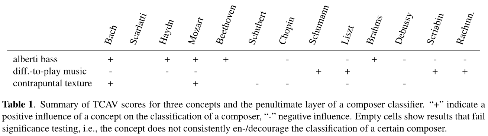
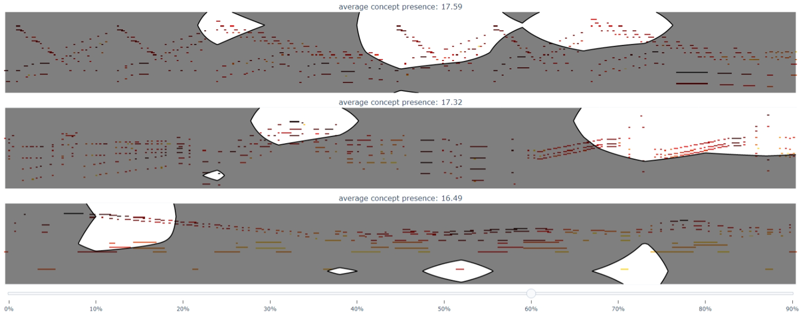

# Concept-Based Explanations For Composer Classification

This repository accompanies the publication: Francesco Foscarin*, Katharina Prinz*, 
Verena Praher*, Arthur Flexer, and Gerhard Widmer, 
"Concept-Based Techniques for ``Musicologist-friendly'' Explanations in a 
Deep Music Classifier", (to be) published in Proceedings of the 23rd ISMIR 2022.

(*) equal contribution.


This README describes how the results can be reproduced in the following steps:

* [Setup](#setup)
* [Composer Classifier [1]](#classifier)
* [Supervised Explanations](#supervised)
* [Unsupervised Explanations](#unsupervised)
* [Results of the Paper](#tabvis) (check this out if you're simply here for reproduction purposes)


## Setup <a name="setup"></a>

The packages we use in this work are defined (with version if necessary) in `requirements.txt`.
If you have `conda` installed, the easiest way to set up an environment for this project
is to run the following:

```
conda create -n py36_cc python=3.6.9
conda activate py36_cc
pip install -r requirements.txt
```

Before running any code, make sure to adapt all paths necessary in 
[`config.py`](config.py). Most importantly, make sure to set the path to 
the MAESTRO dataset and ASAP dataset correctly.

The data path will contain the preprocessed MIDI files; the results path will contains all results from our scripts;
the concepts path points to the concepts; and the splits-root
defines where the data-split-files are/will be stored.
Allthese paths *need not* but *can* be changed. 

### Data

The data we use in this work is the MAESTRO v2.0.0 (MIDI only) [3] which you can download 
[here](https://magenta.tensorflow.org/datasets/maestro). 


## Composer Classifier [1] <a name="classifier"></a>
The composer classifier we use in our work is a reproduction of Kim et al. [1],
meaning that our code in `classifier` is strongly based on the 
[original implementation](https://github.com/KimSSung/Deep-Composer-Classification).

Note that if you want to reproduce our work without training a new classifier, you
can simply run the [generator](classifier/generator.py) (see below) and 
refer to [this part](#trainedclassifier), and skip the rest of this section!

### Data Preprocessing

The proposed approach uses pieces with a single composer and only uses composers with at least
16 pieces. We manually removed the pieces from the original `maestro-v2.0.0.csv` file and stored
it in [meta/maestro-v2.0.0-reduced.csv](classifier/meta/maestro-v2.0.0-reduced.csv).

If the classifier should be re-trained (or new train/validation splits generated),
the first step is to run the generator, i.e., 

```
python -m classifier.generator 
```

This transforms MIDI files to `.npy` files (in our repository with 
[partitura](https://github.com/CPJKU/partitura)). Next, the data split can 
be generated by calling the splitter, e.g., 

```
python -m classifier.splitter
``` 

This automatically creates a random split with 70% of the data used for training,
and the remaining 30% for validation. Finally, we need to run the converter:

```
python -m classifier.converter
``` 

Then we're all set for training the model!

### Trained Model <a name="trainedclassifier"></a>
We provide the already trained model, which we used to perform our experiments in the paper, [here](classifier/meta/2202180921/model/resnet50.pt).
If you want to train your own model, you can use the description below or 
of the original repository.

### Train your own model

To train a ResNet-50 model with the default parameters for e.g., 10 epochs, run
```
python -m classifier.train_model --mode basetrain --model_name resnet50 --epochs 10
```

and adapt the number of epochs as desired. To change the default arguments,
modify the according argument in [arg_parser](classifier/tools/arg_parser.py).
The used configuration will be stored in a `txt`-file in the directory
of the model.

### Evaluate your model

To compute the performance of our model (or compute confusion matrices with `--cm`), 
we provide a respective script that first needs the path to a trained model,
information on whether the onset is omitted or not, and a path to the data-split
files, e.g., 

```
python -m classifier.compute_performance classifier/meta/2202180921/model/resnet50.pt --omit_onset --split-root classifier/meta
```

## Supervised Explanations <a name="supervised"></a>

### Concept Datasets

We provide the concept dataset presented in our work, consisting of 
3 concepts: Alberti bass, difficult-to-play pieces and contrapuntal texture. 
If you want to define your own concept datasets, first think of a concept and
generate/obtain MIDI files. If you have `.mid` files available, they first
need to be converted to `.npy` files, e.g., by running

```
python -m data_handling.convert_concept_midis_to_npy --concept_name <concept_name>
```

This script runs the same pre-processing as for the MIDI data used for training the model.
By running [this shell script](scripts/convert_concept_midis_to_npy.sh) all
of our provided concepts and random datasets are pre-processed correctly.

Note that we fix the mapping of concept names to a *fixed* ID in 
[concept_mapping.json](concepts/concept_mapping.json) to ensure that captum does 
not assign different IDs to a concept in different runs (as CAVs are *not* automatically)
recomputed.

### Testing with CAVs (TCAV)

After we have pre-processed files of a concept, we can start to experiment with 
TCAV. To run one experiment, you can run `test_with_cavs.py`,

``` 
python -m supervised.test_with_cavs <modelfile> --omit-onset --layers <layer(s)> 
    --composer <composername> --save-path <savepath> --concepts <concept(s)> 
    --random-concepts <randomconcept(s)> 
```

Note that this computes TCAV scores for a defined model, composer, for defined 
network-layers, and a list of concepts (where each is confronted with each of the
defined random datasets). The results are stored to the according path.
A more concrete example could be:

``` 
python -m supervised.test_with_cavs classifier/meta/2202180921/model/resnet50.pt --omit-onset --layers layer4 --composer mozart --save-path classifier/experiments/mozart_17 --concepts 1 7 --random-concepts 90
```

This performs testing with CAVs for pieces of mozart, the penultimate layer of the defined
network, for the 'Alberti bass' and 'contrapuntal texture' concepts and the first random 
dataset.

### Significance Tests

A similar functionality is provided in `test_tcav_significance.py` - here, however,
one concept can be defined for which a statistical significance will be run
(with all available random datasets). Calling it can be done very similarly, e.g., 

``` 
python -m supervised.test_tcav_significance <modelfile> --concept <concept> 
    --omit-onset --composer <composername> --save-dir <savedirectory>
```

Or, again a more concrete example, where we call the significance test for
the Alberti bass concept and composer Mozart (for the penultimate layer):

``` 
python -m supervised.test_tcav_significance classifier/meta/2202180921/model/resnet50.pt --concept 1 --omit-onset --composer mozart --save-dir sign_mozart_1 --layers layer4
```

## Unsupervised Explanations <a name="unsupervised"></a>

The code for the unsupervised explanation is heavily based on [this](https://github.com/zhangrh93/InvertibleCE) code from Zhang et al. [4]. We expanded and readapted it to be able to handle MIDI files and the Non Negative Tucker factorization.

### Generating the explanations
To generate an unsupervised explanation for two composer you can run ```generate_uns_explanation.py```
```
python -m unsupervised.generate_uns_explanation
```

The main parameters to specify are:
- reducer: a string, either "NTD" (non negative Tucker decomposition) or "NMF" (non negative matrix factorization) 
- dimension: an integer, either 3 or 4 to select the 3D or 4D Tucker decomposition respectively; this is not used if the reducer is set to NMF
- rank: a string, either containing an integer (e.g. "5", for NMF), or a list of integers (e.g., "[10, 13, 3, 375]" or "[10, 10, 375]" , one for each NTD dimension)
- layer: a string, e.g., "layer4" or "layer3". Be sure to not select ranks higher than the original matrix dimension when running NTD, as this is extremely computationally costly
- targets: a string containing the indices of the two composers to explain; the indices can be retrieve from the following dictionary; for example the explanation between Beethoven and Rachmaninoff will have targets "[9,11]"
```
0 : "Scriabin",
1 : "Debussy",
2 : "Scarlatti",
3 : "Liszt",
4 : "Schubert",
5 : "Chopin",
6 : "Bach",
7 : "Brahms",
8 : "Haydn",
9 : "Beethoven",
10 : "Schumann",
11 : "Rachmaninoff",
12 : "Mozart",
```


Other parameters and further parameter information can be visualize with:
```
python -m unsupervised.generate_uns_explanation --help
```

### Interpreting the explanation
The results are interpreted as following:
1. inspect the ```summary.json``` file inside the generated folder in ```results\```
2. check the `fidelity` of your explanation to make sure it is high enough; the fidelity is computed for the two composers separately, according to the order specified in the parameter "targets", and reported in the field `classes`
3. check the `concept_sensitivity`; this is computed for each concept, for each composer; ideally you want to find a concept that has a high positive number for one composer (i.e., pushing the classifier to classify as this composer) and a low negative number for the other (i.e., pushing the classifier to not classify as this composer); this search is simplified by the following field
4. check the `suggested_CAVs`; this field is containing the concepts that are positive for one composer and negative for the other, sorted by the absolute value of the difference between the two values
5. once you selected an unsupervised concept you want to inspect, you can find a representation of the 5 piece excerpts where this is maximally activated in the folders `feature_imgs` (pianoroll interactive plots, open them with a browser like chrome) and `feature_midis` (midi files, open them with a midi file player, e.g. media player on windows); a representation of the 5 pieces where the concept is minimally activated is also available in the folders `feature_contrast_imgs` and `feature_contrast_midis`


## Results of the Paper <a name="tabvis"></a>

### Figures 1 & 2
These figures are used to explain some notions of our work but do not show results, which is why 
their reproduction is omitted here :)

### Table 1



To reproduce this table, the significance tests have to be run and saved for *all* concepts and *all* 
composers (for the penultimate layer). To simplify this process, you can use 
[this script](scripts/run_significance.sh) we provide which runs all tests automatically,
e.g., 
```
sh scripts/run_significance.sh
```

Make sure that you have all according results available, because the script that helps in reproducing
this table strongly relies on these; then you can simply run 

``` 
python -m supervised.tcav_visualise
```

and you should be good to go! (Note that there can be slight variations in the final results due to 
randomness in the process of creating CAVs - this is not ideal at all, and shows some
of the limitations of this approach :).

### Figure 3

Figure 3 can be obtained by running:
```
python -m unsupervised.generate_uns_explanation --reducer "NTD" --dimension 4 --targets "[5,6]" --layer "layer4" --rank "[4, 13, 3, 375]"
```
double check that the first suggested CAV is the number 3, and open the picture located at `results/layer4_r[4, 13, 3, 375][Chopin_Bach]/feature_imgs/3plotly.html`, and move the threshold cursor to 60%. The figure in the paper only contains the first 3 pieces, but there you can inspect the 5 pieces where the concept 3 is maximally activated.


## References
[1] S. Kim, H. Lee, S. Park, J. Lee, and K. Choi, “Deep Composer Classification Using Symbolic Representation,” 
ISMIR Late Breaking and Demo Papers, 2020.

[2] B. Kim, M. Wattenberg, J. Gilmer, C. J. Cai, J. Wexler, F. B. Viégas, and R. Sayres, “Interpretability Beyond
Feature Attribution: Quantitative Testing with Concept Activation Vectors (TCAV),” in Proceedings of the 35th
International Conference on Machine Learning, ICML. PMLR, 2018, pp. 2673–2682.

[3] C. Hawthorne, A. Stasyuk, A. Roberts, I. Simon, C. A. Huang, S. Dieleman, E. Elsen, J. H. Engel, and D. Eck,
“Enabling Factorized Piano Music Modeling and Generation with the MAESTRO Dataset,” in Proceedings
of the 7th International Conference on Learning Representations, ICLR, 2019.

[4] R. Zhang, P. Madumal, T. Miller, K. A. Ehinger, and B. I. P. Rubinstein, “Invertible Concept-based Explanations 
for CNN Models with Non-negative Concept Activation Vectors,” in Proceedings of the 35th AAAI Conference on Artificial Intelligence, 
AAAI, 2021, pp. 11682–11690.
